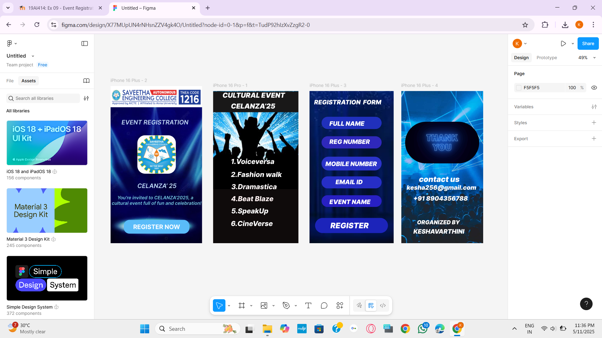

# Ex09 Event Registration Web Application
## Date:08.10.2025

## AIM:
To design, develop and deploy a web application for event registration.

## DESIGN STEPS:

### Step 1:
Create a new frame.

### Step 2:
Select any one preset size of your choice.

### Step 3:
Select the shapes you need.

### Step 4:
Import images as needed.

### Step 5:
Create pages based on your need and link them.

### Step 6:

Validate the HTML and CSS code.

### Step 6:

Publish the website in the given URL.

## DESIGN TOOL:
Figma

## CODE:
```

Home page

<div style="width: 478px; height: 823px; position: relative; background: white; overflow: hidden">
  
  
  
  <div style="width: 254px; height: 62px; left: 97px; top: 138px; position: absolute"></div>
  <div style="width: 367px; height: 61px; left: 57px; top: 170px; position: absolute; color: #C3DBF5; font-size: 32px; font-family: Inter; font-style: italic; font-weight: 600; word-wrap: break-word">EVENT REGISTRATION</div>
  <div style="width: 343px; height: 72px; left: 69px; top: 701px; position: absolute; background: #5ABCF9; border-radius: 30px"></div>
  <div style="width: 410px; height: 72px; left: 118px; top: 718px; position: absolute; color: white; font-size: 32px; font-family: Inter; font-weight: 700; word-wrap: break-word">REGISTER NOW</div>
  <div style="width: 335px; height: 99px; left: 140px; top: 503px; position: absolute; color: #C3E1FA; font-size: 32px; font-family: Inter; font-style: italic; font-weight: 600; word-wrap: break-word">CELANZA’ 25</div>
  <div style="width: 480px; height: 167px; left: 6px; top: 570px; position: absolute; color: #77CEE2; font-size: 24px; font-family: Inter; font-style: italic; font-weight: 600; word-wrap: break-word">     You're invited to CELANZA'2025, a cultural event full of fun and celebration!</div>
</div>


import React from "react";
import styled from "styled-components";

const StyledIndex41 = styled.div`
  width: 748px;
  height: 748px;
  left: -150px;
  top: 75px;
  position: absolute;
`;

const StyledIndex1 = styled.div`
  width: 480px;
  height: 97px;
  left: -2px;
  top: 14px;
  position: absolute;
`;

const StyledIndex21 = styled.div`
  width: 201px;
  height: 201px;
  left: 140px;
  top: 258px;
  position: absolute;
  border-radius: 40px;
`;

const StyledRectangle1 = styled.div`
  width: 254px;
  height: 62px;
  left: 97px;
  top: 138px;
  position: absolute;
`;

const StyledEventregistrationspan = styled.span`
  color: #C3DBF5;
  font-size: 32px;
  font-family: Inter;
  font-style: italic;
  font-weight: 600;
  word-wrap: break-word;
`;

const StyledRectangle2 = styled.div`
  width: 343px;
  height: 72px;
  left: 69px;
  top: 701px;
  position: absolute;
  background: #5ABCF9;
  border-radius: 30px;
`;

const StyledRegisternowspan = styled.span`
  color: white;
  font-size: 32px;
  font-family: Inter;
  font-weight: 700;
  word-wrap: break-word;
`;

const StyledCelanza25span = styled.span`
  color: #C3E1FA;
  font-size: 32px;
  font-family: Inter;
  font-style: italic;
  font-weight: 600;
  word-wrap: break-word;
`;

const StyledYoureinvitedtocelanza2025aculturaleventfulloffunandcelebrationspan = styled.span`
  color: #77CEE2;
  font-size: 24px;
  font-family: Inter;
  font-style: italic;
  font-weight: 600;
  word-wrap: break-word;
`;

const StyledIPhone16Plus2 = styled.div`
  width: 478px;
  height: 823px;
  position: relative;
  background: white;
  overflow: hidden;
`;

export const Iphone16Plus2 = () => {
  return (
    <StyledIPhone16Plus2>
      <StyledIndex41  src="https://placehold.co/748x748"/>
      <StyledIndex1  src="https://placehold.co/480x97"/>
      <StyledIndex21  src="https://placehold.co/201x201"/>
      <StyledRectangle1 />
      <StyledEVENTREGISTRATION>EVENT REGISTRATION</StyledEVENTREGISTRATION>
      <StyledRectangle2 />
      <StyledREGISTERNOW>REGISTER NOW</StyledREGISTERNOW>
      <StyledCELANZA25>CELANZA’ 25</StyledCELANZA25>
      <StyledYoureinvitedtoCELANZA2025aculturaleventfulloffunandcelebration>     You're invited to CELANZA'2025, a cultural event full of fun and celebration!</StyledYoureinvitedtoCELANZA2025aculturaleventfulloffunandcelebration>
    </StyledIPhone16Plus2>
  );
};


Second page

<div style="width: 446px; height: 797px; position: relative; background: white; overflow: hidden">
  
  <div style="width: 446px; height: 315px; left: 0px; top: 514px; position: absolute; background: #0F0B0B"></div>
  <div style="width: 273px; height: 66px; left: 95px; top: 479px; position: absolute; color: #FFFAFA; font-size: 36px; font-family: Inter; font-style: italic; font-weight: 800; word-wrap: break-word">3.Dramastica</div>
  <div style="width: 269px; height: 64px; left: 94px; top: 542px; position: absolute; color: #FFF3F3; font-size: 36px; font-family: Inter; font-style: italic; font-weight: 800; word-wrap: break-word">4.Beat Blaze</div>
  <div style="width: 238px; height: 52px; left: 93px; top: 347px; position: absolute; color: white; font-size: 36px; font-family: Inter; font-style: italic; font-weight: 800; word-wrap: break-word">1.Voiceversa<br/></div>
  <div style="width: 283px; height: 47px; left: 93px; top: 415px; position: absolute; color: white; font-size: 36px; font-family: Inter; font-style: italic; font-weight: 800; word-wrap: break-word">2.Fashion walk</div>
  <div style="width: 282px; height: 55px; left: 95px; top: 606px; position: absolute; color: white; font-size: 36px; font-family: Inter; font-style: italic; font-weight: 800; word-wrap: break-word">5.SpeakUp</div>
  <div style="width: 272px; height: 61px; left: 93px; top: 672px; position: absolute; color: white; font-size: 36px; font-family: Inter; font-style: italic; font-weight: 800; word-wrap: break-word">6.CineVerse</div>
  <div style="width: 462px; height: 108px; left: -16px; top: 3px; position: absolute; background: #1A1818"></div>
  <div style="width: 375px; height: 38px; left: 49px; top: 0px; position: absolute; color: white; font-size: 36px; font-family: Inter; font-style: italic; font-weight: 900; word-wrap: break-word">CULTURAL EVENT</div>
  <div style="width: 352px; height: 34px; left: 93px; top: 57px; position: absolute; color: white; font-size: 36px; font-family: Inter; font-style: italic; font-weight: 900; word-wrap: break-word">CELANZA’25</div>
</div>


import React from "react";
import styled from "styled-components";

const StyledIndex31 = styled.div`
  width: 797px;
  height: 795px;
  left: -192px;
  top: -189px;
  position: absolute;
`;

const StyledRectangle3 = styled.div`
  width: 446px;
  height: 315px;
  left: 0px;
  top: 514px;
  position: absolute;
  background: #0F0B0B;
`;

const Styled3dramasticaspan = styled.span`
  color: #FFFAFA;
  font-size: 36px;
  font-family: Inter;
  font-style: italic;
  font-weight: 800;
  word-wrap: break-word;
`;

const Styled4beatblazespan = styled.span`
  color: #FFF3F3;
  font-size: 36px;
  font-family: Inter;
  font-style: italic;
  font-weight: 800;
  word-wrap: break-word;
`;

const Styled1voiceversaspan = styled.span`
  color: white;
  font-size: 36px;
  font-family: Inter;
  font-style: italic;
  font-weight: 800;
  word-wrap: break-word;
`;

const Styled2fashionwalkspan = styled.span`
  color: white;
  font-size: 36px;
  font-family: Inter;
  font-style: italic;
  font-weight: 800;
  word-wrap: break-word;
`;

const Styled5speakupspan = styled.span`
  color: white;
  font-size: 36px;
  font-family: Inter;
  font-style: italic;
  font-weight: 800;
  word-wrap: break-word;
`;

const Styled6cineversespan = styled.span`
  color: white;
  font-size: 36px;
  font-family: Inter;
  font-style: italic;
  font-weight: 800;
  word-wrap: break-word;
`;

const StyledRectangle = styled.div`
  width: 462px;
  height: 108px;
  left: -16px;
  top: 3px;
  position: absolute;
  background: #1A1818;
`;

const StyledCulturaleventspan = styled.span`
  color: white;
  font-size: 36px;
  font-family: Inter;
  font-style: italic;
  font-weight: 900;
  word-wrap: break-word;
`;

const StyledCelanza25span = styled.span`
  color: white;
  font-size: 36px;
  font-family: Inter;
  font-style: italic;
  font-weight: 900;
  word-wrap: break-word;
`;

const StyledIPhone16Pro1 = styled.div`
  width: 446px;
  height: 797px;
  position: relative;
  background: white;
  overflow: hidden;
`;

export const Iphone16Pro1 = () => {
  return (
    <StyledIPhone16Pro1>
      <StyledIndex31  src="https://placehold.co/797x795"/>
      <StyledRectangle3 />
      <Styled3Dramastica>3.Dramastica</Styled3Dramastica>
      <Styled4BeatBlaze>4.Beat Blaze</Styled4BeatBlaze>
      <Styled1Voiceversa>1.Voiceversa<br/></Styled1Voiceversa>
      <Styled2Fashionwalk>2.Fashion walk</Styled2Fashionwalk>
      <Styled5SpeakUp>5.SpeakUp</Styled5SpeakUp>
      <Styled6CineVerse>6.CineVerse</Styled6CineVerse>
      <StyledRectangle />
      <StyledCULTURALEVENT>CULTURAL EVENT</StyledCULTURALEVENT>
      <StyledCELANZA25>CELANZA’25</StyledCELANZA25>
    </StyledIPhone16Pro1>
  );
};


Third page

<div style="width: 440px; height: 797px; position: relative; background: white; overflow: hidden">
  
  <div style="width: 416px; height: 77px; left: 24px; top: 39px; position: absolute; color: white; font-size: 32px; font-family: Inter; font-style: italic; font-weight: 900; word-wrap: break-word">REGISTRATION  FORM</div>
  <div style="width: 314px; height: 64px; left: 63px; top: 135px; position: absolute; background: #2030BC; border-radius: 100px"></div>
  <div style="width: 363px; height: 60px; left: 104px; top: 151px; position: absolute; color: white; font-size: 32px; font-family: Inter; font-style: italic; font-weight: 900; word-wrap: break-word">FULL NAME</div>
  <div style="width: 314px; height: 64px; left: 63px; top: 237px; position: absolute; background: #2F28BB; border-radius: 100px"></div>
  <div style="width: 347px; height: 58px; left: 104px; top: 246px; position: absolute; color: white; font-size: 32px; font-family: Inter; font-style: italic; font-weight: 900; word-wrap: break-word">REG NUMBER</div>
  <div style="width: 314px; height: 72px; left: 63px; top: 344px; position: absolute; background: #2B33C9; border-radius: 100px"></div>
  <div style="width: 345px; height: 74px; left: 83px; top: 362px; position: absolute; color: white; font-size: 32px; font-family: Inter; font-style: italic; font-weight: 900; word-wrap: break-word">MOBILE NUMBER</div>
  <div style="width: 314px; height: 63px; left: 63px; top: 447px; position: absolute; background: #262EC6; border-radius: 100px"></div>
  <div style="width: 412px; height: 78px; left: 136px; top: 457px; position: absolute; color: white; font-size: 32px; font-family: Inter; font-style: italic; font-weight: 900; word-wrap: break-word">EMAIL ID</div>
  <div style="width: 314px; height: 61px; left: 63px; top: 546px; position: absolute; background: #2820C3; border-radius: 100px"></div>
  <div style="width: 409px; height: 61px; left: 104px; top: 561px; position: absolute; color: white; font-size: 32px; font-family: Inter; font-style: italic; font-weight: 900; word-wrap: break-word">EVENT NAME</div>
  <div style="width: 381px; height: 79px; left: 29px; top: 665px; position: absolute; background: #1C24BA; border-radius: 200px"></div>
  <div style="width: 404px; height: 84px; left: 109px; top: 680px; position: absolute; color: white; font-size: 40px; font-family: Inter; font-style: italic; font-weight: 900; word-wrap: break-word">REGISTER</div>
</div>


import React from "react";
import styled from "styled-components";

const StyledIndex51 = styled.div`
  width: 1466px;
  height: 826px;
  left: -531px;
  top: -29px;
  position: absolute;
`;

const StyledRegistrationformspan = styled.span`
  color: white;
  font-size: 32px;
  font-family: Inter;
  font-style: italic;
  font-weight: 900;
  word-wrap: break-word;
`;

const StyledRoundedrectangle = styled.div`
  width: 314px;
  height: 64px;
  left: 63px;
  top: 135px;
  position: absolute;
  background: #2030BC;
  border-radius: 100px;
`;

const StyledFullnamespan = styled.span`
  color: white;
  font-size: 32px;
  font-family: Inter;
  font-style: italic;
  font-weight: 900;
  word-wrap: break-word;
`;

const StyledRectangle4 = styled.div`
  width: 314px;
  height: 64px;
  left: 63px;
  top: 237px;
  position: absolute;
  background: #2F28BB;
  border-radius: 100px;
`;

const StyledRegnumberspan = styled.span`
  color: white;
  font-size: 32px;
  font-family: Inter;
  font-style: italic;
  font-weight: 900;
  word-wrap: break-word;
`;

const StyledRectangle5 = styled.div`
  width: 314px;
  height: 72px;
  left: 63px;
  top: 344px;
  position: absolute;
  background: #2B33C9;
  border-radius: 100px;
`;

const StyledMobilenumberspan = styled.span`
  color: white;
  font-size: 32px;
  font-family: Inter;
  font-style: italic;
  font-weight: 900;
  word-wrap: break-word;
`;

const StyledRectangle6 = styled.div`
  width: 314px;
  height: 63px;
  left: 63px;
  top: 447px;
  position: absolute;
  background: #262EC6;
  border-radius: 100px;
`;

const StyledEmailidspan = styled.span`
  color: white;
  font-size: 32px;
  font-family: Inter;
  font-style: italic;
  font-weight: 900;
  word-wrap: break-word;
`;

const StyledRectangle7 = styled.div`
  width: 314px;
  height: 61px;
  left: 63px;
  top: 546px;
  position: absolute;
  background: #2820C3;
  border-radius: 100px;
`;

const StyledEventnamespan = styled.span`
  color: white;
  font-size: 32px;
  font-family: Inter;
  font-style: italic;
  font-weight: 900;
  word-wrap: break-word;
`;

const StyledRectangle8 = styled.div`
  width: 381px;
  height: 79px;
  left: 29px;
  top: 665px;
  position: absolute;
  background: #1C24BA;
  border-radius: 200px;
`;

const StyledRegisterspan = styled.span`
  color: white;
  font-size: 40px;
  font-family: Inter;
  font-style: italic;
  font-weight: 900;
  word-wrap: break-word;
`;

const StyledIPhone16Plus3 = styled.div`
  width: 440px;
  height: 797px;
  position: relative;
  background: white;
  overflow: hidden;
`;

export const Iphone16Plus3 = () => {
  return (
    <StyledIPhone16Plus3>
      <StyledIndex51  src="https://placehold.co/1466x826"/>
      <StyledREGISTRATIONFORM>REGISTRATION  FORM</StyledREGISTRATIONFORM>
      <StyledRoundedrectangle />
      <StyledFULLNAME>FULL NAME</StyledFULLNAME>
      <StyledRectangle4 />
      <StyledREGNUMBER>REG NUMBER</StyledREGNUMBER>
      <StyledRectangle5 />
      <StyledMOBILENUMBER>MOBILE NUMBER</StyledMOBILENUMBER>
      <StyledRectangle6 />
      <StyledEMAILID>EMAIL ID</StyledEMAILID>
      <StyledRectangle7 />
      <StyledEVENTNAME>EVENT NAME</StyledEVENTNAME>
      <StyledRectangle8 />
      <StyledREGISTER>REGISTER</StyledREGISTER>
    </StyledIPhone16Plus3>
  );
};


Fourth page

<div style="width: 428px; height: 797px; position: relative; background: white; overflow: hidden">
  
  
  <div style="width: 387px; height: 49px; left: 92px; top: 437px; position: absolute; color: white; font-size: 40px; font-family: Inter; font-style: italic; font-weight: 900; word-wrap: break-word">contact us</div>
  <div style="width: 379px; height: 35px; left: 28px; top: 486px; position: absolute; color: white; font-size: 32px; font-family: Inter; font-style: italic; font-weight: 900; word-wrap: break-word">kesha256@gmail.com</div>
  <div style="width: 389px; height: 62px; left: 63px; top: 543px; position: absolute; color: white; font-size: 32px; font-family: Inter; font-style: italic; font-weight: 900; word-wrap: break-word">+91 8904356788</div>
  <div style="width: 407px; height: 46px; left: 82px; top: 670px; position: absolute; color: white; font-size: 29px; font-family: Inter; font-style: italic; font-weight: 900; word-wrap: break-word">ORGANIZED BY</div>
  <div style="width: 365px; height: 47px; left: 63px; top: 716px; position: absolute; color: white; font-size: 32px; font-family: Inter; font-style: italic; font-weight: 900; word-wrap: break-word">KESHAVARTHINI</div>
</div>


import React from "react";
import styled from "styled-components";

const StyledIndex771 = styled.div`
  width: 800px;
  height: 1422px;
  left: -273px;
  top: -433px;
  position: absolute;
`;

const StyledIndex78 = styled.div`
  width: 387px;
  height: 218px;
  left: 20px;
  top: 161px;
  position: absolute;
  border-radius: 400px;
`;

const StyledContactusspan = styled.span`
  color: white;
  font-size: 40px;
  font-family: Inter;
  font-style: italic;
  font-weight: 900;
  word-wrap: break-word;
`;

const StyledKesha256gmailcomspan = styled.span`
  color: white;
  font-size: 32px;
  font-family: Inter;
  font-style: italic;
  font-weight: 900;
  word-wrap: break-word;
`;

const Styled918904356788span = styled.span`
  color: white;
  font-size: 32px;
  font-family: Inter;
  font-style: italic;
  font-weight: 900;
  word-wrap: break-word;
`;

const StyledOrganizedbyspan = styled.span`
  color: white;
  font-size: 29px;
  font-family: Inter;
  font-style: italic;
  font-weight: 900;
  word-wrap: break-word;
`;

const StyledKeshavarthinispan = styled.span`
  color: white;
  font-size: 32px;
  font-family: Inter;
  font-style: italic;
  font-weight: 900;
  word-wrap: break-word;
`;

const StyledIPhone16Plus4 = styled.div`
  width: 428px;
  height: 797px;
  position: relative;
  background: white;
  overflow: hidden;
`;

export const Iphone16Plus4 = () => {
  return (
    <StyledIPhone16Plus4>
      <StyledIndex771  src="https://placehold.co/800x1422"/>
      <StyledIndex78  src="https://placehold.co/387x218"/>
      <StyledContactus>contact us</StyledContactus>
      <StyledKesha256gmailcom>kesha256@gmail.com</StyledKesha256gmailcom>
      <Styled918904356788>+91 8904356788</Styled918904356788>
      <StyledORGANIZEDBY>ORGANIZED BY</StyledORGANIZEDBY>
      <StyledKESHAVARTHINI>KESHAVARTHINI</StyledKESHAVARTHINI>
    </StyledIPhone16Plus4>
  );
};


```

## OUTPUT:


## RESULT:
The program to design, develop and deploy a web application for event registration is completed successfully.
